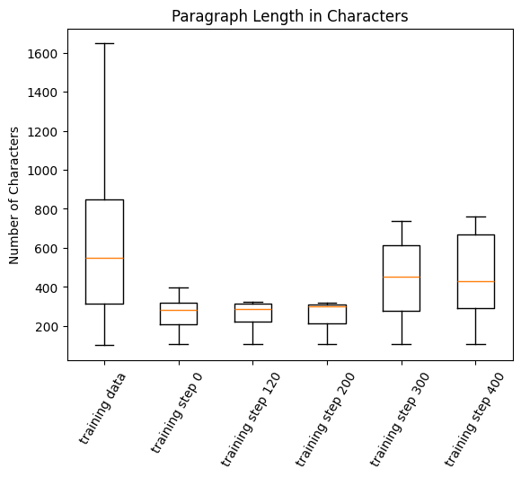
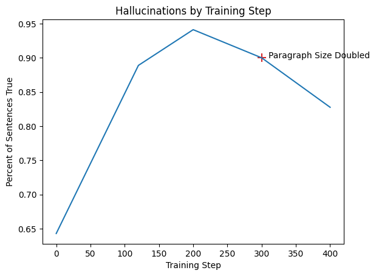
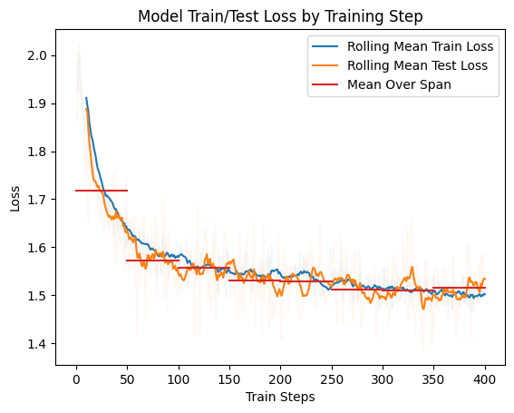

    </img>
    </img>

# BlogGPT: Choosing the final model
***

[**Paragraph Length**](#1)
| [**Hallucinations**](#2)
| [**Train/Test Loss**](#3)
| [**Conclusion**](#4)

## Paragraph Length
***

When comparing LLama 3 instruct to the training data, the paragraph lengths were much shorter than the standard blog.  Though out training training the paragraph length improved.

As you can see, by training step 300, the paragraph length was within the acceptable range of a regular blog.

 

## Hallucinations
***

The number of hallucinations was reduced throughout training.

Though the hallucinations slightly increased at step 300, the number of output sentences per paragraph doubled.  By this metric, step 300 performed best.

## Train/Test Loss

The lowest testing loss occurs around step 300. The red bars illustrate this, showing the mean of roughly one epoch of testing loss.  Beyond step 350, problematic overfitting begins, with the training loss going down but the testing loss starting to go up.

## Conclusion

Based on three factors of increasing paragraph length, minimizing hallucinations, and avoiding problematic overfitting, the weights from step 300 are the optimal option and will be chosen the the model.